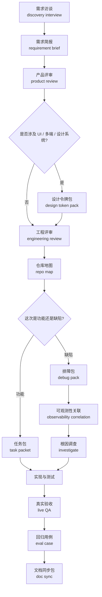

# Usage Guide | 完整使用手册

这份文档不是 README 的展开版，而是这套协议真正的使用说明书。

如果你想知道：

- 整个项目最终该怎么用
- 不同场景该走哪条流程
- 哪些工件必须上，哪些可以后补
- 一个人开发、小团队协作、生产级产品分别该怎么落地

优先看这份文档。

## 一句话定位

`ai-dev-runtime-protocol` 适合解决的不是“怎么让 AI 多写点代码”，而是：

- 怎么让 AI 少走弯路
- 怎么让 AI 少扫无关文件
- 怎么让一次开发有清晰阶段
- 怎么让线上 bug 有编号、有证据、有回归
- 怎么让 UI、文档、日志、测试和代码保持同步

## 适用场景

最适合：

- 你主要靠 Claude、Codex、Cursor 这类 AI 编程助手开发
- 项目已经不止一个页面或一个脚本
- 你开始遇到上下文爆炸、token 爆炸、README 漂移、修 bug 靠猜
- 你想把“想法 -> 实现 -> 验证 -> 收尾”变成稳定流程
- 你在做 AI 原生产品，或者至少在做 AI 深度参与的产品

不太适合：

- 只有一个几十行的小脚本
- 一次性 demo，做完就扔
- 完全没有代码库、也不打算积累工程资产
- 对测试、日志、文档和回归没有任何要求

## 核心心法

这套协议的核心不是工件数量，而是下面 5 条：

1. 先收敛，再开工。需求不清楚时，不要直接让 AI 写代码。
2. 先缩圈，再排障。定位 bug 时，不要先扫全仓。
3. 先定边界，再放权。让 Agent 在清晰范围内行动，而不是无边界自由发挥。
4. 先验证真实路径，再相信结果。单元测试过了，不等于用户路径没问题。
5. 先同步系统说明，再宣布完成。README 和文档不是附属品，而是当前系统全貌。

## 整体流程图

## 你到底该怎么用

### 路线 A：从一个模糊想法开始

适用：

- 你脑子里只有一个方向感
- 你还说不清第一版到底做什么
- 你怕一上来就做大、做偏

推荐流程：

1. `discovery-interview | 需求访谈`
2. `requirement-brief | 需求简报`
3. `plan-product-review | 产品评审`
4. `plan-engineering-review | 工程评审`
5. `repo-map | 仓库地图`
6. `task-packet | 任务包`
7. 实现
8. `qa-live | 真实验收`
9. `doc-sync | 文档同步包`

关键判断：

- 需求访谈的目标不是把所有细节聊完，而是把“第一版必须做什么”定清楚
- 产品评审负责砍 scope，不负责设计数据库
- 工程评审负责把改动面缩到可控，而不是一上来大重构

### 路线 B：在现有项目里加一个新功能

适用：

- 仓库已经存在
- 你知道要做什么
- 重点是控制范围、不要误伤旧系统

推荐流程：

1. `repo-map`
2. `plan-engineering-review`
3. `task-packet`
4. 必要时补 `domain-map` 和 `tool-contract`
5. 实现与测试
6. `qa-live`
7. `doc-sync`

关键判断：

- 不清楚读哪些文件时，先生成仓库地图
- 不清楚该改哪里时，先做工程评审，不要直接开扫
- 如果这个功能会新增业务域、工具、计划执行链路，就不要只写 task packet，要同时补高级工件

### 路线 C：线上或真实使用中出现 bug

适用：

- 用户反馈 bug
- 本地能看到异常，但说不清在哪一层出错
- 你已经有 trace id、decision id 或日志文件

推荐流程：

1. `repo-map`
2. `debug-pack`
3. `observability-correlation`
4. `investigate`
5. 定点修复
6. `qa-live`
7. `eval-case`
8. `doc-sync`

关键判断：

- `debug-pack` 负责定义症状和排查短名单
- `observability-correlation` 负责用真实日志缩圈
- `investigate` 负责写出根因解释，不允许直接“试试看改一下”
- 修完后必须沉淀 `eval-case`，否则同一类 bug 还会回来

### 路线 D：你这次主要在做 UI / 设计系统 / 多端界面

适用：

- 新页面、新主题、新组件库
- AI 生成 UI 经常风格乱漂
- Web、App、设计稿口径不统一

推荐流程：

1. `requirement-brief`
2. `design-token-pack`
3. `plan-product-review`
4. `plan-engineering-review`
5. `task-packet`
6. 实现
7. `qa-live`
8. `doc-sync`

关键判断：

- `design-token-pack` 应该先于组件代码
- `.html` 预览页是必看的，不是附属物
- 如果改的是品牌气质、色板、层级、语义令牌，README 往往要重写相关章节

### 路线 E：你在做 AI 原生产品底座

适用：

- 你不是只做页面和接口，而是在做 Agent 系统
- 涉及跨域编排、工具调用、计划执行、日志追踪、权限预算
- 你已经开始碰到“能跑，但不可维护”的问题

推荐流程：

1. `requirement-brief`
2. `plan-product-review`
3. `domain-map`
4. `tool-contract`
5. `execution-plan`
6. `cost-privacy-budget`
7. `repo-map`
8. `task-packet` 或 `debug-pack`
9. `observability-correlation`
10. 实现与验证
11. `eval-case`
12. `doc-sync`

关键判断：

- `domain-map` 解决的是“谁拥有状态”
- `tool-contract` 解决的是“工具怎么保持原子、简单、可组合”
- `execution-plan` 解决的是“贵的推理”和“便宜的执行”怎么拆开
- `cost-privacy-budget` 解决的是“能 demo”到“能长期跑”的差距

## 每个工件到底什么时候上

### 基础必备

几乎所有中等以上项目都建议使用：

- `repo-map`
- `task-packet`
- `debug-pack`
- `eval-case`
- `doc-sync`

### 需求与评审层

需求还不稳定时建议使用：

- `discovery-interview`
- `requirement-brief`
- `plan-product-review`
- `plan-engineering-review`

### 视觉系统层

涉及 UI 时建议使用：

- `design-token-pack`

### AI 原生运行层

涉及 Agent、工具、日志链路、预算控制时建议使用：

- `domain-map`
- `tool-contract`
- `execution-plan`
- `observability-correlation`
- `cost-privacy-budget`

## CLI 命令该怎么分组理解

### 初始化与全局认知

- `init-workspace`
- `repo-map`
- `requirement-brief`

### 需求和评审输入

- `discovery interview` 目前以模板为主
- `requirement-brief`

### 任务执行输入

- `task-packet`
- `debug-pack`
- `execution-plan`

### 架构与边界

- `domain-map`
- `tool-contract`
- `cost-privacy-budget`

### 排障与可观测性

- `observability-correlation`
- `trace-start`
- `trace-event`
- `eval-case`

### 视觉系统

- `design-token-pack`

### 收尾与治理

- `doc-sync`

## 一个人开发，应该怎么上这套协议

推荐最小组合：

- `repo-map`
- `task-packet`
- `debug-pack`
- `eval-case`
- `doc-sync`

如果你是产品感很强、但工程基础一般的 Builder，再加：

- `requirement-brief`
- `plan-product-review`
- `design-token-pack`

如果你已经开始做 Agent 产品，再加：

- `domain-map`
- `tool-contract`
- `execution-plan`
- `observability-correlation`

## 小团队怎么用

推荐分工：

- 产品或负责人维护 `requirement-brief`、产品评审结论、`design-token-pack`
- 工程负责人维护 `plan-engineering-review`、`domain-map`、`tool-contract`
- 开发执行者围绕 `task-packet` 或 `debug-pack` 工作
- QA 或发布责任人维护 `eval-case`、`qa-live` 记录、`doc-sync`

关键要求：

- 不允许每个人用自己的话描述需求，必须回到工件
- 不允许跳过根因调查直接修 bug
- 不允许功能改完不补 README / 手册 / 示例

## 三个真实使用示范

### 场景 1：你想做一个 AI 会议助手

起点：

- 你只知道“我想让 AI 帮我安排会议”

建议：

1. 先跑需求访谈，搞清楚第一版是“找空档排会”还是“自动邀约+改期+冲突处理”
2. 产出 `requirement-brief`
3. 在产品评审里砍掉非第一版能力
4. 用工程评审决定只改聊天入口还是同时改日历页
5. 生成 `task-packet`
6. 完成后跑真实验收，再同步文档

### 场景 2：现有产品删除事件总是删错对象

起点：

- 用户说“我点第二条，删掉的是第三条”

建议：

1. 先写 `debug-pack`
2. 用 `trace_id / decision_id / entrypoint / failure_stage` 跑 `observability-correlation`
3. 看真实日志命中了哪几个步骤
4. 在 `investigate` 里写清是 ID 传错、映射错还是 UI 绑定错
5. 修复后补 `eval-case`
6. 如果对外行为变了，再跑 `doc-sync`

### 场景 3：AI 生成的界面越来越不像一个产品

起点：

- 页面能用，但颜色、字号、圆角、层级都开始乱

建议：

1. 不要再继续让 AI 直接写页面
2. 先生成 `design-token-pack`
3. 打开 HTML 预览看视觉方向
4. 调完令牌后，再用它约束后续组件开发
5. 文档里补“设计令牌是事实来源”

## 常见误区

### 误区一：把这套协议当成 Prompt 集

这套系统的价值不在 prompt，而在：

- 阶段路由
- 结构化工件
- 真实日志缩圈
- 回归与文档同步

### 误区二：每个任务都上全量工件

不是所有任务都要用完全部工件。

正确方式是：

- 小任务用最小组合
- 跨域任务再补高级工件
- 线上问题再补可观测性关联和回归

### 误区三：有了 Agent 就不需要结构化边界

相反，Agent 越强，越需要：

- `domain-map`
- `tool-contract`
- `execution-plan`
- `cost-privacy-budget`

### 误区四：README 只是对外介绍，不重要

如果 README 不反映当前系统，你的 Agent、合作者和未来的自己都会被误导。

## 推荐阅读顺序

第一次接触本项目，建议按这个顺序看：

1. [README.md](../../README.md)
2. [docs/architecture-架构说明.md](../architecture-架构说明.md)
3. [docs/playbooks/stage-router-阶段路由.md](../playbooks/stage-router-阶段路由.md)
4. [docs/reference/vercel-ai-sdk-理解与借鉴.md](../reference/vercel-ai-sdk-理解与借鉴.md)
5. [examples/README.md](../../examples/README.md)

如果你已经准备在真实项目里落地，继续看：

1. [docs/playbooks/plan-engineering-review-工程评审.md](../playbooks/plan-engineering-review-工程评审.md)
2. [docs/playbooks/investigate-根因调查.md](../playbooks/investigate-根因调查.md)
3. [docs/playbooks/observability-correlation-可观测性关联.md](../playbooks/observability-correlation-可观测性关联.md)
4. [docs/playbooks/documentation-sync-文档同步.md](../playbooks/documentation-sync-文档同步.md)
